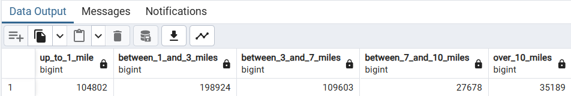

# 🖋️ Module 1 Homework: Docker & SQL

This README provides solutions to various questions related to Docker, SQL, and Terraform workflows. Each section includes the problem, relevant SQL queries or Docker configurations, and the solutions.

---

## Question 1: Understanding Docker First Run

Run Docker with the `python:3.12.8` image in interactive mode and use `bash` as the entrypoint.

**What is the version of `pip` in the image?**

**Solution:**  


The answer is: **`24.3.1`**

---

## Question 2: Docker Networking and Docker-Compose

Given the following `docker-compose.yaml`, what is the `hostname` and `port` that **pgAdmin** should use to connect to the PostgreSQL database?

```yaml
services:
  db:
    container_name: postgres
    image: postgres:17-alpine
    environment:
      POSTGRES_USER: "postgres"
      POSTGRES_PASSWORD: "postgres"
      POSTGRES_DB: "ny_taxi"
    ports:
      - "5433:5432"
    volumes:
      - vol-pgdata:/var/lib/postgresql/data

  pgadmin:
    container_name: pgadmin
    image: dpage/pgadmin4:latest
    environment:
      PGADMIN_DEFAULT_EMAIL: "pgadmin@pgadmin.com"
      PGADMIN_DEFAULT_PASSWORD: "pgadmin"
    ports:
      - "8080:80"
    volumes:
      - vol-pgadmin_data:/var/lib/pgadmin

volumes:
  vol-pgdata:
    name: vol-pgdata
  vol-pgadmin_data:
    name: vol-pgadmin_data
```

**Solution:**  


The answer is: **`postgres:5432`**

---

## Question 3: Trip Segmentation Count

For trips between October 1st, 2019 (inclusive) and November 1st, 2019 (exclusive), how many trips occurred:

1. Up to 1 mile
2. Between 1 (exclusive) and 3 miles (inclusive)
3. Between 3 (exclusive) and 7 miles (inclusive)
4. Between 7 (exclusive) and 10 miles (inclusive)
5. Over 10 miles

```sql
SELECT
    SUM(CASE WHEN trip_distance <= 1 THEN 1 ELSE 0 END) AS up_to_1_mile,
    SUM(CASE WHEN trip_distance > 1 AND trip_distance <= 3 THEN 1 ELSE 0 END) AS between_1_and_3_miles,
    SUM(CASE WHEN trip_distance > 3 AND trip_distance <= 7 THEN 1 ELSE 0 END) AS between_3_and_7_miles,
    SUM(CASE WHEN trip_distance > 7 AND trip_distance <= 10 THEN 1 ELSE 0 END) AS between_7_and_10_miles,
    SUM(CASE WHEN trip_distance > 10 THEN 1 ELSE 0 END) AS over_10_miles
FROM green_taxi_trips
WHERE lpep_pickup_datetime >= '2019-10-01'
  AND lpep_dropoff_datetime < '2019-11-01';
```



The answer is: **`104,802; 198,924; 109,603; 27,678; 35,189`**

---

## Question 4: Longest Trip for Each Day

Which was the pickup day with the longest trip distance? Use the pickup time for your calculations.

**Tip:** For every day, we only care about one single trip with the longest distance.


The answer is: **`2019-10-11`**

---

## Question 5: Three Biggest Pickup Zones

Which were the top pickup locations with over 13,000 in `total_amount` (across all trips) for 2019-10-18?

Consider only `lpep_pickup_datetime` when filtering by date.

```sql
SELECT tz."Zone", SUM(tp."total_amount")
FROM green_taxi_trips tp
INNER JOIN taxi_zone tz
    ON tp."PULocationID" = tz."LocationID"
WHERE tp.lpep_pickup_datetime >= '2019-10-18'
    AND tp.lpep_pickup_datetime < '2019-10-19'
GROUP BY tz."Zone"
ORDER BY SUM(tp."total_amount") DESC
LIMIT 3;
```


The answer is: **`East Harlem North, East Harlem South, Morningside Heights`**

---

## Question 6: Largest Tip

For passengers picked up in October 2019 in the zone named "East Harlem North," which was the drop-off zone that had the largest tip?

**Note:** It's `tip`, not `trip`. We need the name of the zone, not the ID.

```sql
SELECT tzd."Zone" AS drop_off_zone, MAX(tp.tip_amount) AS tips
FROM green_taxi_trips tp
LEFT JOIN taxi_zone tzp
ON tp."PULocationID" = tzp."LocationID"
LEFT JOIN taxi_zone tzd
ON tp."DOLocationID" = tzd."LocationID"
WHERE tp.lpep_pickup_datetime >= '2019-10-1'
    AND tp.lpep_pickup_datetime < '2019-11-1'
    AND tzp."Zone" = 'East Harlem North'
GROUP BY tzd."Zone"
ORDER BY MAX(tp.tip_amount) DESC
LIMIT 1;
```


The answer is: **`JFK Airport`**

---

## Question 7: Terraform Workflow

Which of the following sequences, **respectively**, describes the workflow for:

1. Downloading the provider plugins and setting up the backend.
2. Generating proposed changes and auto-executing the plan.
3. Removing all resources managed by Terraform.


```
$ terraform apply -auto-approve

Terraform used the selected providers to generate the following execution plan. Resource actions are indicated with the following symbols:
  + create

Terraform will perform the following actions:

  # google_bigquery_dataset.demo_dataset will be created
  + resource "google_bigquery_dataset" "demo_dataset" {
      + creation_time              = (known after apply)
      + dataset_id                 = "demo_dataset"
      + default_collation          = (known after apply)
      + delete_contents_on_destroy = false
      + effective_labels           = {
          + "goog-terraform-provisioned" = "true"
        }
      + etag                       = (known after apply)
      + id                         = (known after apply)
      + is_case_insensitive        = (known after apply)
      + last_modified_time         = (known after apply)
      + location                   = "US"
      + max_time_travel_hours      = (known after apply)
      + project                    = "terraform-demo-448604"
      + self_link                  = (known after apply)
      + storage_billing_model      = (known after apply)
      + terraform_labels           = {
          + "goog-terraform-provisioned" = "true"
        }

      + access (known after apply)
    }

  # google_storage_bucket.demo-bucket will be created
  + resource "google_storage_bucket" "demo-bucket" {
      + effective_labels            = {
          + "goog-terraform-provisioned" = "true"
        }
      + force_destroy               = true
      + id                          = (known after apply)
      + location                    = "US"
      + name                        = "terraform-demo-448604-terra-bucket"
      + project                     = (known after apply)
      + project_number              = (known after apply)
      + public_access_prevention    = (known after apply)
      + rpo                         = (known after apply)
      + self_link                   = (known after apply)
      + storage_class               = "STANDARD"
      + terraform_labels            = {
          + "goog-terraform-provisioned" = "true"
        }
      + uniform_bucket_level_access = (known after apply)
      + url                         = (known after apply)

      + lifecycle_rule {
          + action {
              + type          = "AbortIncompleteMultipartUpload"
                # (1 unchanged attribute hidden)
            }
          + condition {
              + age                    = 1
              + matches_prefix         = []
              + matches_storage_class  = []
              + matches_suffix         = []
              + with_state             = (known after apply)
                # (3 unchanged attributes hidden)
            }
        }

      + soft_delete_policy (known after apply)

      + versioning (known after apply)

      + website (known after apply)
    }

Plan: 2 to add, 0 to change, 0 to destroy.
google_bigquery_dataset.demo_dataset: Creating...
google_storage_bucket.demo-bucket: Creating...
google_bigquery_dataset.demo_dataset: Creation complete after 1s [id=projects/terraform-demo-448604/datasets/demo_dataset]
google_storage_bucket.demo-bucket: Creation complete after 2s [id=terraform-demo-448604-terra-bucket]

Apply complete! Resources: 2 added, 0 changed, 0 destroyed.
```

### Cloud Storage buckets


---

### BigQuery datasets


---

```
$ terraform destroy
google_storage_bucket.demo-bucket: Refreshing state... [id=terraform-demo-448604-terra-bucket]
google_bigquery_dataset.demo_dataset: Refreshing state... [id=projects/terraform-demo-448604/datasets/demo_dataset]

Terraform used the selected providers to generate the following execution plan. Resource actions are indicated with the following symbols:
  - destroy

Terraform will perform the following actions:

  # google_bigquery_dataset.demo_dataset will be destroyed
  - resource "google_bigquery_dataset" "demo_dataset" {
      - creation_time                   = 1737552961202 -> null
      - dataset_id                      = "demo_dataset" -> null
      - default_partition_expiration_ms = 0 -> null
      - default_table_expiration_ms     = 0 -> null
      - delete_contents_on_destroy      = false -> null
      - effective_labels                = {
          - "goog-terraform-provisioned" = "true"
        } -> null
      - etag                            = "1XSE04TZZFhYzoOt8GDU2w==" -> null
      - id                              = "projects/terraform-demo-448604/datasets/demo_dataset" -> null
      - is_case_insensitive             = false -> null
      - labels                          = {} -> null
      - last_modified_time              = 1737552961202 -> null
      - location                        = "US" -> null
      - max_time_travel_hours           = "168" -> null
      - project                         = "terraform-demo-448604" -> null
      - resource_tags                   = {} -> null
      - self_link                       = "https://bigquery.googleapis.com/bigquery/v2/projects/terraform-demo-448604/datasets/demo_dataset" -> null
      - terraform_labels                = {
          - "goog-terraform-provisioned" = "true"
        } -> null
        # (4 unchanged attributes hidden)

      - access {
          - role           = "OWNER" -> null
          - user_by_email  = "terraform-runner@terraform-demo-448604.iam.gserviceaccount.com" -> null
            # (4 unchanged attributes hidden)
        }
      - access {
          - role           = "OWNER" -> null
          - special_group  = "projectOwners" -> null
            # (4 unchanged attributes hidden)
        }
      - access {
          - role           = "READER" -> null
          - special_group  = "projectReaders" -> null
            # (4 unchanged attributes hidden)
        }
      - access {
          - role           = "WRITER" -> null
          - special_group  = "projectWriters" -> null
            # (4 unchanged attributes hidden)
        }
    }

  # google_storage_bucket.demo-bucket will be destroyed
  - resource "google_storage_bucket" "demo-bucket" {
      - default_event_based_hold    = false -> null
      - effective_labels            = {
          - "goog-terraform-provisioned" = "true"
        } -> null
      - enable_object_retention     = false -> null
      - force_destroy               = true -> null
      - id                          = "terraform-demo-448604-terra-bucket" -> null
      - labels                      = {} -> null
      - location                    = "US" -> null
      - name                        = "terraform-demo-448604-terra-bucket" -> null
      - project                     = "terraform-demo-448604" -> null
      - project_number              = 977809919257 -> null
      - public_access_prevention    = "inherited" -> null
      - requester_pays              = false -> null
      - rpo                         = "DEFAULT" -> null
      - self_link                   = "https://www.googleapis.com/storage/v1/b/terraform-demo-448604-terra-bucket" -> null
      - storage_class               = "STANDARD" -> null
      - terraform_labels            = {
          - "goog-terraform-provisioned" = "true"
        } -> null
      - uniform_bucket_level_access = false -> null
      - url                         = "gs://terraform-demo-448604-terra-bucket" -> null

      - hierarchical_namespace {
          - enabled = false -> null
        }

      - lifecycle_rule {
          - action {
              - type          = "AbortIncompleteMultipartUpload" -> null
                # (1 unchanged attribute hidden)
            }
          - condition {
              - age                                     = 1 -> null
              - days_since_custom_time                  = 0 -> null
              - days_since_noncurrent_time              = 0 -> null
              - matches_prefix                          = [] -> null
              - matches_storage_class                   = [] -> null
              - matches_suffix                          = [] -> null
              - num_newer_versions                      = 0 -> null
              - send_age_if_zero                        = false -> null
              - send_days_since_custom_time_if_zero     = false -> null
              - send_days_since_noncurrent_time_if_zero = false -> null
              - send_num_newer_versions_if_zero         = false -> null
              - with_state                              = "ANY" -> null
                # (3 unchanged attributes hidden)
            }
        }

      - soft_delete_policy {
          - effective_time             = "2025-01-22T13:36:01.266Z" -> null
          - retention_duration_seconds = 604800 -> null
        }
    }

Plan: 0 to add, 0 to change, 2 to destroy.

Do you really want to destroy all resources?
  Terraform will destroy all your managed infrastructure, as shown above.
  There is no undo. Only 'yes' will be accepted to confirm.

  Enter a value: yes

google_storage_bucket.demo-bucket: Destroying... [id=terraform-demo-448604-terra-bucket]
google_bigquery_dataset.demo_dataset: Destroying... [id=projects/terraform-demo-448604/datasets/demo_dataset]
google_bigquery_dataset.demo_dataset: Destruction complete after 1s
google_storage_bucket.demo-bucket: Destruction complete after 2s

Destroy complete! Resources: 2 destroyed.
```

The answer is: **`terraform init, terraform apply -auto-approve, terraform destroy`**
