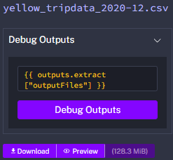
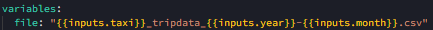
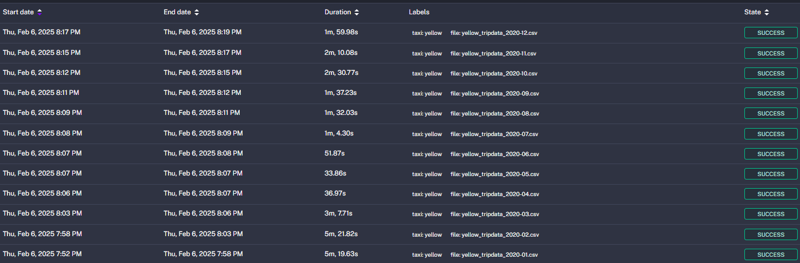
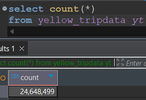

# 🖋️ Module 2 Homework

---

## Question 1: Within the execution for `Yellow` Taxi data for the year `2020` and month `12`: what is the uncompressed file size (i.e. the output file `yellow_tripdata_2020-12.csv` of the `extract` task)?

Run Docker with the `python:3.12.8` image in interactive mode and use `bash` as the entrypoint.

**What is the version of `pip` in the image?**

**Solution:**  

The answer is: **`128.3 MB`**

---

## Question 2: What is the rendered value of the variable file when the inputs taxi is set to green, year is set to 2020, and month is set to 04 during execution?

**Solution:**  

input.taxi = `green`
input.year = `2020`
input.month = `04`
file = `{{inputs.taxi}}_tripdata_{{inputs.year}}-{{inputs.month}}.csv`

So the file will be rendered in the following format `green_tripdata_2020-04.csv`

The answer is: **`green_tripdata_2020-04.csv`**

---

## Question 3: Number of rows (yellow, 2020)

**Solution:**  

The answer is: **`24648499`**
